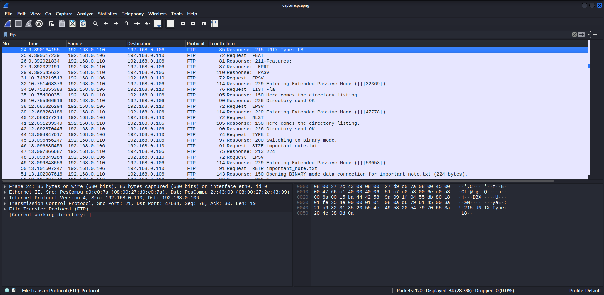
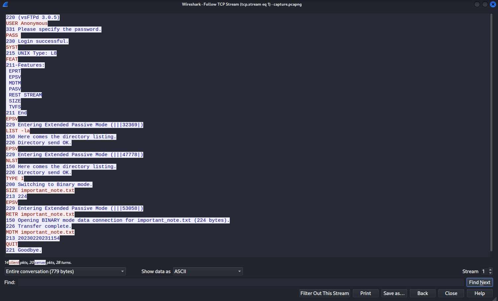
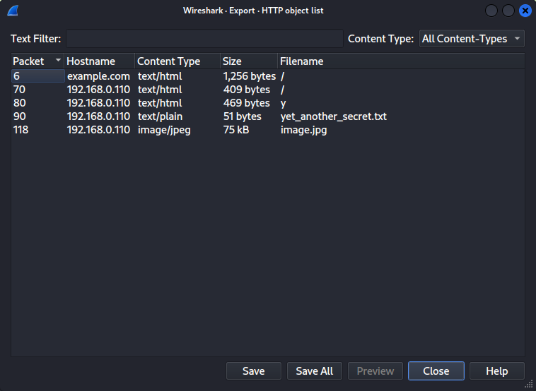

# Network Traffic Forensics

In today's world, networks are a fundamental part of our daily lives that enable us to communicate, access information, and carry out various online activities. However, networks are also a prime target for bad actors who seek to cause harm by exploiting vulnerabilities.

In this lab, we will start with a refresher on the basics of networks, including IP addresses, protocols, and ports. We will explore how these elements work together to facilitate communication between devices.

Next, we will move on to the forensic analysis of network traffic. We will analyze captured traffic for suspicious or malicious activity, which will involve looking for anomalies in traffic patterns, identifying unauthorized access attempts, and tracing the source of any attacks.

# Basic Networking Refresher

To put it simply, a network is a group of devices that are connected to each other to communicate, share information, files, and resources. These devices need to have an IP address, a protocol, and a port to communicate with each other, and understanding these is crucial for any digital forensics analyst as these fundamentals are the building blocks of investigating any malicious activity on a network.

## IP Addresses

An IP address is a unique identifier assigned to each device on a network. It is used to identify the device's location and facilitate communication with other devices. An example of an IP address is “192.168.1.1”.

## Protocols

A protocol is a set of rules that govern the communication between devices on a network. Some common protocols include HTTP, SSH, and FTP.

For example, when you browse a website, your computer sends an HTTP request to the web server, which responds with an HTTP response that contains the webpage you requested.

## Ports

A port is a number used to identify a specific application or service on a device. When a device receives network traffic, it uses the port number to determine which application or service the traffic is intended for.

For example, when you access a website using HTTP, your browser sends the request to port 80 on the web server.

The following table presents a mapping between some commonly used protocols and their port numbers:

| Protocol | Port |
| --- | --- |
| FTP (File Transfer Protocol) | 21 |
| SSH (Secure Shell) | 22 |
| Telnet (Teletype Network) | 23 |
| SMTP (Simple Mail Transfer Protocol) | 25 |
| DNS (Domain Name System) | 53 |
| DHCP (Dynamic Host Configuration Protocol) | 67/68 |
| HTTP (Hyper Text Transfer Protocol) | 80 |
| HTTPS (Hyper Text Transfer Protocol Secure) | 443 |
| SMB (Server Message Block) | 445 |
| RDP (Remote Desktop Protocol) | 3389 |
| ICMP (Internet Control Message Protocol) | N/A |

# Network Traffic Forensics

In this section, let’s explore the tools and techniques used to capture and analyze network traffic, extract valuable information, detect suspicious behavior, and investigate attacks on the network.

## Capturing Network Traffic

The pre requisite to perform network traffic forensics is to capture the network traffic. This can be achieved using a network packet capture or sniffing tool, such as Wireshark or tcpdump. For this lab, we’ll mainly be using Wireshark, so make sure you have it installed on your machine. 

To capture live network traffic, follow the steps below:

1. Open Wireshark by entering `wireshark` in the terminal on Linux or through the Start menu on Windows.
2. Once it is open, select a network interface that you want to capture traffic on. In most cases, it is `eth0`.
3. Click the blue colored shark’s fin icon on top left of the window to start capturing traffic.
4. In most cases you should already see packets begin to appear on Wireshark. If not, you can try generating some traffic by visiting a website in your browser, like [https://www.google.com/](https://www.google.com/).
5. To stop capturing traffic, click the stop button in red on top left.
6. To save the capture traffic, go to File → Save as, and select a name and location to save the capture file.

> Note: By default, the file extension should be `.pcapng`. Another commonly used extension for capture files is `.pcap`.

## Analyzing Network Traffic

The next step in network traffic forensics is to analyze the captured network traffic. This involves examining the network traffic to identify suspicious activity, attempts for unauthorized access, and extracting information such as:

- source and destination IP addresses and ports
- protocols
- data/payload transmitted
- date and time of the activity

While there are many features available in Wireshark for network forensics, some of the most commonly used ones include viewing protocol hierarchy, applying filters, viewing packet details and packet bytes, following TCP streams, and exporting objects.

To begin analyzing sample captured network traffic, download the file from the URL [https://github.com/vonderchild/digital-forensics-lab/blob/main/Lab 5/files/capture.pcapng](https://github.com/vonderchild/digital-forensics-lab/blob/main/Lab%205/files/capture.pcapng) and open it in Wireshark. 

### Protocol Hierarchy

To get a general overview of the captured network traffic, we can go to Statistics → Protocol Hierarchy to see which protocols are being used in the capture, and the relative amount of packets for each protocol. This helps us narrow down our analysis and filter for suspicious traffic.

### Filters

We can also apply filters to focus on traffic of our interest. This makes it easier to analyze and view only the relevant packets that we need. 

The following image demonstrates how to filter for HTTP packets:

Similarly, we can filter for FTP packets:

To see what other filters Wireshark supports, refer to [https://wiki.wireshark.org/DisplayFilters](https://wiki.wireshark.org/DisplayFilters).

### Packet Details and Packet Bytes

The packet details pane shows the selected packet in a more detailed form, whereas the packet bytes pane shows the data of the selected packet in a hexdump format. These panes are located at the bottom of the Wireshark window.

### Follow TCP Stream

The Follow TCP Stream feature in Wireshark displays the entire conversation for a particular TCP connection. This makes it easier to see the full details of the connection and any data transmitted during that connection. To use this feature, we can right click on any packet, then select Follow → TCP Stream.

### Export Objects

The Export Objects feature allows us to extract files from captured network traffic. To access this feature, we can select File" → "Export Objects".

In the "HTTP" sub-menu, we can view a list of files that were transferred over HTTP during the capture. After selecting the file(s) that we want to extract, we can save them by clicking on the "Save" button.

## Conclusion

Network traffic forensics is an essential part of digital forensics, as it enables us to identify malicious activity, potential security breaches and other anomalies on a network. In addition to Wireshark, there are other tools like Network Miner, Brim, and Zeek that are great for analyzing captured traffic, so it's worth checking them out and experimenting with them.

# Exercises

The organization that previously hired you to investigate the web attack has reached out to you again. This time, they have managed to capture the network traffic during the attack. They have provided you with the captured traffic file to help piece together the attacker's intentions and the extent of the damage. Your job is to analyze the captured traffic and answer the following questions:

1. What are the different protocols present in the captured traffic file?
2. It appears that the attacker is attempting to brute force the user's FTP password. Can you find any evidence of a correct password, and if so, what is it?
3. What additional information was the attacker able to extract from the user's FTP account?
4. What actions did the attacker take with the information obtained from the user's FTP account?
5. What’s the root account password?
6. Can you identify the packet numbers in which the attacker exploited the Remote Code Execution vulnerability to gain access to the system? What was the exact payload used by the attacker?
7. After gaining access to the system, what does the attacker seem to be doing?
8. The attacker read a file from root’s home directory. What was in that file?
9. The attacker downloaded a file inside `/tmp` directory. What’s the purpose of that file?
10. What information was transmitted through the attacker’s covertly established channel of communication?

The traffic capture file can be downloaded from [https://github.com/vonderchild/digital-forensics-lab/blob/main/Lab 5/files/challenge.pcapng](https://github.com/vonderchild/digital-forensics-lab/blob/main/Lab%205/files/challenge.pcapng).